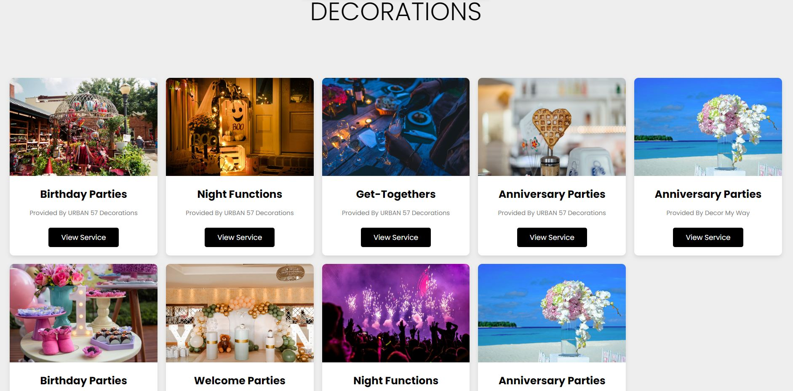
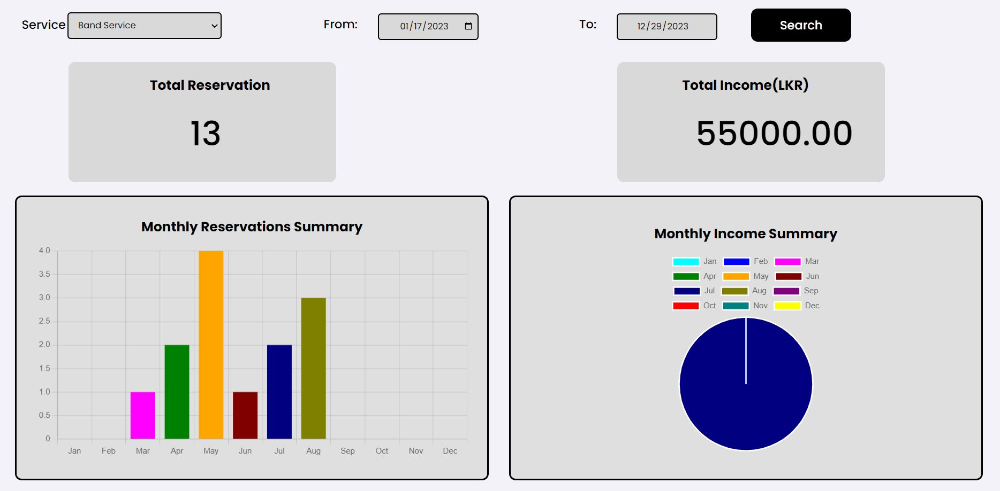

# "TruEvent Horizons" - An Event Planning Management System for both Customers and Service Providers

TruEvent Horizons is an event planning management system which facilitate a common platform to customers and service
providers when it comes to event planning activities.

## Supervision and Guidance

- Supervisor: Mr. Roshan Abeyweera
    - email: rns@ucsc.cmb.ac.lk
    - linkedin: https://www.linkedin.com/in/roshan-nadeesha/

- Co-Supervisor: Ms. Akna Delgodaarachchi
    - email: ald@ucsc.cmb.ac.lk
    - linkedin: https://www.linkedin.com/in/lakminakna/

## Group Members of the Project

- Saneru Akarawita
    - email: 2020cs007@stu.ucsc.cmb.ac.lk
    - linkedin: https://www.linkedin.com/in/saneru-akarawita-17a700216/

- Chirasi Amaya Walpola
    - email: 2020cs197@stu.ucsc.cmb.ac.lk
    - linkedin: https://www.linkedin.com/in/chirasi-amaya-094a36221/

- Kaveesha Muthukuda
    - email: 2020cs118@stu.ucsc.cmb.ac.lk
    - linkedin: https://www.linkedin.com/in/kaveesha-muthukuda-7b279b1ba/

- Harini Jayawardhana
    - email: 2020cs088@stu.ucsc.cmb.ac.lk
    - linkedin: https://www.linkedin.com/in/harini-jayawardhana-079000217/

## Subsystems
- Online reservation management.
- Services and packages management.
- Event management using calenders
- Payment Handling
- Report generation
- User chatting

## Users
- Customers
- Service Providers
    - Hotel Managers
    - Photographers
    - Decoration Companies
    - Musical Bands
- Admin
- Super Admin

## Product Features
- Allow customers to place reservations based on their preference of date, time, service and service provider.
- Manage reservations based on date, time, and selected service provider's availability and availability of resources.
- Provide a daily overview of upcoming reservations to service providers.
- Handle reservation reschedule/cancel requests by both customers and service providers.
- Handle payment of reservations.
- Generate reports and analysis.
- Inform new/updates of reservations to customers and service providers via Email.

## Screen Captures

